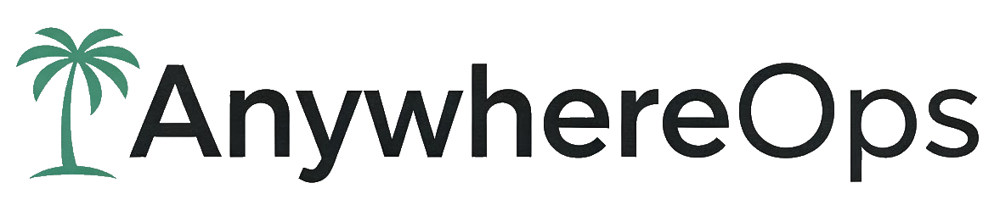

## [AnywhereOps](https://anywhereops.ai) - Customer-First IT for Innovative Organizations
AutoPkg recipes for automated macOS software deployment via Munki. These recipes automate downloading and importing software packages into your Munki repository.

## Dependencies
Some recipes in this repo:
- Have parent recipes in other repos,
- Rely on recipes from other repos, or
- Use processors from other repos
- Please verify recipes with `autopkg info <recipe_name>` to check for these dependencies.

## Available Recipes

| Application | Description | Status |
|-------------|-------------|--------|
| DellDisplayAndPeripheralManager | Dell monitor and peripheral management | Complete |
| DYMO Connect | Label printer software | Complete |
| EndNote2025 | Citation management | Complete |
| InstallSQLAnywhere | SQL Anywhere database client | Development |
| JohnsonControlsLauncher | Johnson Controls building automation | Development |
| 3D Slicer | Medical imaging and visualization (KitwareInc) | Development/Testing |
| Mitel MiTeam Meetings | Video conferencing | Complete |
| OpenClaw | "Your own personal AI assistant. Any OS. Any Platform. The lobster way | Complete |
| PasswordSafe | Password manager | Complete |
| QuPath | Bioimage analysis for pathology | Complete |
| SeqGeq | Flow cytometry data analysis | In Development |
| Smartsheet | Project management and collaboration | Complete |
| Testcontainers Desktop | Docker testing framework | Complete |
| XCodeCLITools | Apple Xcode command line tools | Testing |

